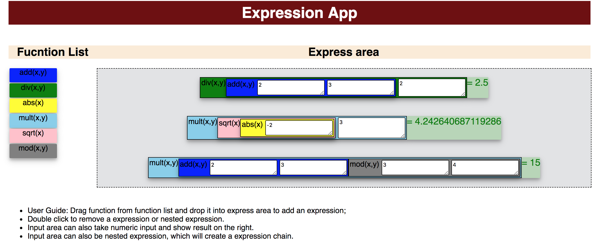
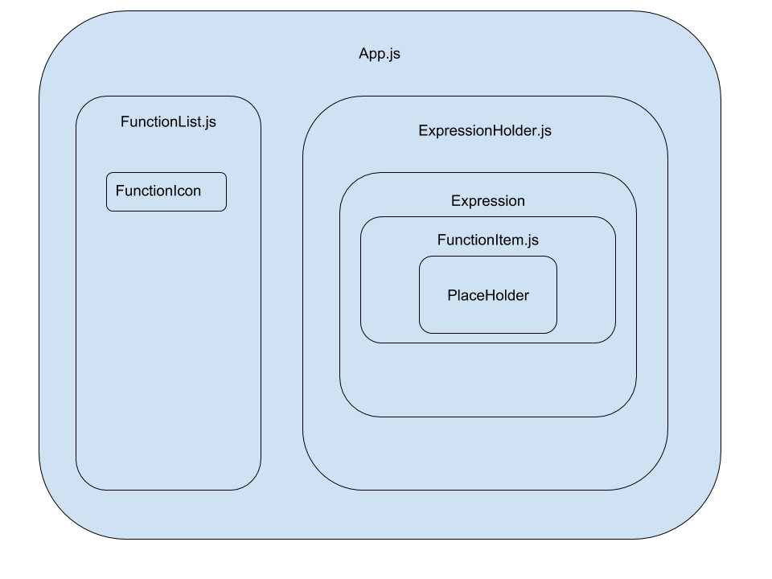

## Quick Start:

1. Install npm on your computer
2. Run: `npm start` to run the server
3. run : `npm install` if node modules missing
4. open `localhost:3000' in your browser

### A screen shot of the application:


## Code structure:

```
src/
  |--App.js # Main endpoint of the expression app
  |--FunctionList.js  # React component to render the function list 
  |--FcuntionHolder.js # React component to render the express area and expressions.
  |--FunctionItem.js # React Component to render the function and input place holder 

```

## Component relationship:



The `FunctionList` and `ExpressionHolder` components have already explained in the code structure section. `Expression` is a container of expression chain, which contains three components: __Icon__, __FunctionItem__, and __result__. __icon__ is just a label show the image of function and __result__ shows the final result of the expression.

`FunctionItem` is the core componnet of this app, which contains `PlaceHolder` component as input. `PlaceHolder` is default a `<textarea></textarea>` which takes numeric value as input. When user dragg and drop a function into the `PlaceHolder`, the textarea will be rendered as a `FunctionItem` component and return the result of the `FunctionItem` using callback function. 

